# 1. SpringApplication
## 1.1. 自定义 banner

1. 类路径添加banner.txt或设置spring.banner.location就可以定制 banner
2. 推荐网站：[Spring Boot banner 在线生成工具，制作下载英文 banner.txt，修改替换 banner.txt 文字实现自定义，个性化启动 banner-bootschool.net](https://www.bootschool.net/ascii)
## 1.2. 自定义 SpringApplication
```java
import org.springframework.boot.Banner;
import org.springframework.boot.SpringApplication;
import org.springframework.boot.autoconfigure.SpringBootApplication;

@SpringBootApplication
public class MyApplication {

    public static void main(String[] args) {
        SpringApplication application = new SpringApplication(MyApplication.class);
        application.setBannerMode(Banner.Mode.OFF);
        application.run(args);
    }

}
```
## 1.3. FluentBuilder API
```java
new SpringApplicationBuilder()
    .sources(Parent.class)
    .child(Application.class)
    .bannerMode(Banner.Mode.OFF)
    .run(args);
```

# 2. Profiles
> 环境隔离能力；快速切换开发、测试、生产环境
> 步骤：
> 1. **标识环境**：指定哪些组件、配置在哪个环境生效
> 2. **切换环境**：这个环境对应的所有组件和配置就应该生效

## 2.1. 使用
### 2.1.1 指定环境

- Spring Profiles 提供一种**隔离配置**的方式，使其仅在**特定环境**生效；
- 任何@Component, @Configuration 或 @ConfigurationProperties 可以使用 @Profile 标记，来指定何时被加载。【**容器中的组件**都可以被 `@Profile`标记】

### 2.1.2 环境激活

1. 配置激活指定环境； 配置文件
```properties
spring.profiles.active=production,hsqldb
```

2. 也可以使用命令行激活。--spring.profiles.active=dev,hsqldb
3. 还可以配置**默认环境**； 不标注@Profile 的组件永远都存在。
   1. 以前默认环境叫default
   2. `spring.profiles.default=test`
4. 推荐使用激活方式激活指定环境


### 2.1.3 环境包含
注意：

1. spring.profiles.active 和spring.profiles.default 只能用到** 无 profile 的文件**中，如果在application-dev.yaml中编写就是**无效的**
2. 也可以额外添加生效文件，而不是激活替换。比如：
```properties
spring.profiles.include[0]=common
spring.profiles.include[1]=local
```


最佳实战：

- **生效的环境 **= **激活的环境/默认环境**  + **包含的环境**
- 项目里面这么用
   - 基础的配置`mybatis`、`log`、`xxx`：写到**包含环境中**
   - 需要动态切换变化的 `db`、`redis`：写到**激活的环境中**
## 2.2. Profile 分组
创建prod组，指定包含db和mq配置
```
spring.profiles.group.prod[0]=db
spring.profiles.group.prod[1]=mq
```
使用--spring.profiles.active=prod ，就会激活prod，db，mq配置文件

## 2.3. Profile 配置文件

- `application-{profile}.properties`可以作为**指定环境的配置文件**。
- 激活这个环境，**配置**就会生效。最终生效的所有**配置**是
   - `application.properties`：主配置文件，任意时候都生效
   - `application-{profile}.properties`：指定环境配置文件，激活指定环境生效

profile优先级 > application 
# 3. 外部化配置
> **场景**：线上应用如何**快速修改配置**，并应**用最新配置**？
> - SpringBoot 使用  **配置优先级** + **外部配置**  简化配置更新、简化运维。
> - 只需要给`jar`应用所在的文件夹放一个`application.properties`最新配置文件，重启项目就能自动应用最新配置


## 3.1. 配置优先级
Spring Boot 允许将**配置外部化**，以便可以在不同的环境中使用相同的应用程序代码。
我们可以使用各种**外部配置源**，包括Java Properties文件、YAML文件、环境变量和命令行参数。
@Value可以获取值，也可以用@ConfigurationProperties将所有属性绑定到java object中
**以下是 SpringBoot 属性源加载顺序。后面的会覆盖前面的值**。由低到高，高优先级配置覆盖低优先级

1. **默认属性**（通过`SpringApplication.setDefaultProperties`指定的）
2. @PropertySource指定加载的配置（需要写在@Configuration类上才可生效）
3. **配置文件（application.properties/yml等）**
4. RandomValuePropertySource支持的random.*配置（如：@Value("${random.int}")）
5. OS 环境变量
6. Java 系统属性（System.getProperties()）
7. JNDI 属性（来自java:comp/env）
8. ServletContext 初始化参数
9. ServletConfig 初始化参数
10. SPRING_APPLICATION_JSON属性（内置在环境变量或系统属性中的 JSON）
11. **命令行参数**
12. 测试属性。(@SpringBootTest进行测试时指定的属性)
13. 测试类@TestPropertySource注解
14. Devtools 设置的全局属性。($HOME/.config/spring-boot)
> 结论：配置可以写到很多位置，常见的优先级顺序：
> - `命令行`> `配置文件`> `springapplication配置`


**配置文件优先级**如下：(**后面覆盖前面**)

1. **jar 包内**的application.properties/yml
2. **jar 包内**的application-{profile}.properties/yml
3. **jar 包外**的application.properties/yml
4. **jar 包外**的application-{profile}.properties/yml

**建议**：**用一种格式的配置文件**。`**如果.properties和.yml同时存在,则.properties优先**`
> 结论：`包外 > 包内`； 同级情况：`profile配置 > application配置`

**所有参数均可由命令行传入，使用**`**--参数项=参数值**`**，将会被添加到环境变量中，并优先于**`**配置文件**`**。**
**比如**`**java -jar app.jar --name="Spring"**`**,可以使用**`**@Value("${name}")**`**获取**

演示场景：

- 包内： application.properties   `server.port=8000`
- 包内： application-dev.properties    `server.port=9000`
- 包外：  application.properties   `server.port=8001`
- 包外： application-dev.properties    `server.port=9001`

启动端口？：命令行 > `9001` > `8001` > `9000` > `8000`

## 3.2. 外部配置
SpringBoot 应用启动时会自动寻找application.properties和application.yaml位置，进行加载。顺序如下：（**后面覆盖前面**）

1. 类路径: 内部
   1. 类根路径
   2. 类下/config包
2. 当前路径（项目所在的位置）
   1. 当前路径
   2. 当前下/config子目录
   3. /config目录的直接子目录


最终效果：优先级由高到低，前面覆盖后面

- 命令行 > 包外config直接子目录 > 包外config目录 > 包外根目录 > 包内目录
- 同级比较： 
   - profile配置 > 默认配置
   - properties配置 > yaml配置



规律：最外层的最优先。

- 命令行 > 所有
- 包外 > 包内
- config目录 > 根目录
- profile > application 

配置不同就都生效（互补），配置相同高优先级覆盖低优先级
## 3.3. 导入配置
使用spring.config.import可以导入额外配置
```
spring.config.import=my.properties
my.property=value
```
无论以上写法的先后顺序，my.properties的值总是优先于直接在文件中编写的my.property。

## 3.4. 属性占位符
配置文件中可以使用 ${name:default}形式取出之前配置过的值。
```properties
app.name=MyApp
app.description=${app.name} is a Spring Boot application written by ${username:Unknown}
```

# 4. 单元测试-JUnit5
## 4.1. 整合
SpringBoot 提供一系列测试工具集及注解方便我们进行测试。
spring-boot-test提供核心测试能力，spring-boot-test-autoconfigure 提供测试的一些自动配置。
我们只需要导入spring-boot-starter-test 即可整合测试

```
<dependency>
    <groupId>org.springframework.boot</groupId>
    <artifactId>spring-boot-starter-test</artifactId>
    <scope>test</scope>
</dependency>
```

spring-boot-starter-test 默认提供了以下库供我们测试使用

- [JUnit 5](https://junit.org/junit5/)
- [Spring Test](https://docs.spring.io/spring-framework/docs/6.0.4/reference/html/testing.html#integration-testing)
- [AssertJ](https://assertj.github.io/doc/)
- [Hamcrest](https://github.com/hamcrest/JavaHamcrest)
- [Mockito](https://site.mockito.org/)
- [JSONassert](https://github.com/skyscreamer/JSONassert)
- [JsonPath](https://github.com/jayway/JsonPath)

## 4.2. 测试
### 4.2.0 组件测试
直接`@Autowired`容器中的组件进行测试
### 4.2.1 注解
JUnit5的注解与JUnit4的注解有所变化
[https://junit.org/junit5/docs/current/user-guide/#writing-tests-annotations](https://junit.org/junit5/docs/current/user-guide/#writing-tests-annotations)

- **@Test :**表示方法是测试方法。但是与JUnit4的@Test不同，他的职责非常单一不能声明任何属性，拓展的测试将会由Jupiter提供额外测试
- **@ParameterizedTest :**表示方法是参数化测试，下方会有详细介绍
- **@RepeatedTest :**表示方法可重复执行，下方会有详细介绍
- **@DisplayName :**为测试类或者测试方法设置展示名称
- **@BeforeEach :**表示在每个单元测试之前执行
- **@AfterEach :**表示在每个单元测试之后执行
- **@BeforeAll :**表示在所有单元测试之前执行
- **@AfterAll :**表示在所有单元测试之后执行
- **@Tag :**表示单元测试类别，类似于JUnit4中的@Categories
- **@Disabled :**表示测试类或测试方法不执行，类似于JUnit4中的@Ignore
- **@Timeout :**表示测试方法运行如果超过了指定时间将会返回错误
- **@ExtendWith :**为测试类或测试方法提供扩展类引用
```java
import static org.junit.jupiter.api.Assertions.fail;
import static org.junit.jupiter.api.Assumptions.assumeTrue;

import org.junit.jupiter.api.AfterAll;
import org.junit.jupiter.api.AfterEach;
import org.junit.jupiter.api.BeforeAll;
import org.junit.jupiter.api.BeforeEach;
import org.junit.jupiter.api.Disabled;
import org.junit.jupiter.api.Test;

class StandardTests {

    @BeforeAll
    static void initAll() {
    }

    @BeforeEach
    void init() {
    }

    @DisplayName("😱")
    @Test
    void succeedingTest() {
    }

    @Test
    void failingTest() {
        fail("a failing test");
    }

    @Test
    @Disabled("for demonstration purposes")
    void skippedTest() {
        // not executed
    }

    @Test
    void abortedTest() {
        assumeTrue("abc".contains("Z"));
        fail("test should have been aborted");
    }

    @AfterEach
    void tearDown() {
    }

    @AfterAll
    static void tearDownAll() {
    }

}
```

### 4.2.2 断言
| 方法 | 说明 |
| --- | --- |
| assertEquals | 判断两个对象或两个原始类型是否相等 |
| assertNotEquals | 判断两个对象或两个原始类型是否不相等 |
| assertSame | 判断两个对象引用是否指向同一个对象 |
| assertNotSame | 判断两个对象引用是否指向不同的对象 |
| assertTrue | 判断给定的布尔值是否为 true |
| assertFalse | 判断给定的布尔值是否为 false |
| assertNull | 判断给定的对象引用是否为 null |
| assertNotNull | 判断给定的对象引用是否不为 null |
| assertArrayEquals | 数组断言 |
| assertAll | 组合断言 |
| assertThrows | 异常断言 |
| assertTimeout | 超时断言 |
| fail | 快速失败 |

### 4.2.3 嵌套测试
> JUnit 5 可以通过 Java 中的内部类和@Nested 注解实现嵌套测试，从而可以更好的把相关的测试方法组织在一起。在内部类中可以使用@BeforeEach 和@AfterEach 注解，而且嵌套的层次没有限制。

```java
@DisplayName("A stack")
class TestingAStackDemo {

    Stack<Object> stack;

    @Test
    @DisplayName("is instantiated with new Stack()")
    void isInstantiatedWithNew() {
        new Stack<>();
    }

    @Nested
    @DisplayName("when new")
    class WhenNew {

        @BeforeEach
        void createNewStack() {
            stack = new Stack<>();
        }

        @Test
        @DisplayName("is empty")
        void isEmpty() {
            assertTrue(stack.isEmpty());
        }

        @Test
        @DisplayName("throws EmptyStackException when popped")
        void throwsExceptionWhenPopped() {
            assertThrows(EmptyStackException.class, stack::pop);
        }

        @Test
        @DisplayName("throws EmptyStackException when peeked")
        void throwsExceptionWhenPeeked() {
            assertThrows(EmptyStackException.class, stack::peek);
        }

        @Nested
        @DisplayName("after pushing an element")
        class AfterPushing {

            String anElement = "an element";

            @BeforeEach
            void pushAnElement() {
                stack.push(anElement);
            }

            @Test
            @DisplayName("it is no longer empty")
            void isNotEmpty() {
                assertFalse(stack.isEmpty());
            }

            @Test
            @DisplayName("returns the element when popped and is empty")
            void returnElementWhenPopped() {
                assertEquals(anElement, stack.pop());
                assertTrue(stack.isEmpty());
            }

            @Test
            @DisplayName("returns the element when peeked but remains not empty")
            void returnElementWhenPeeked() {
                assertEquals(anElement, stack.peek());
                assertFalse(stack.isEmpty());
            }
        }
    }
}
```

### 4.2.4 参数化测试
参数化测试是JUnit5很重要的一个新特性，它使得用不同的参数多次运行测试成为了可能，也为我们的单元测试带来许多便利。

利用**@ValueSource**等注解，指定入参，我们将可以使用不同的参数进行多次单元测试，而不需要每新增一个参数就新增一个单元测试，省去了很多冗余代码。

**@ValueSource**: 为参数化测试指定入参来源，支持八大基础类以及String类型,Class类型
**@NullSource**: 表示为参数化测试提供一个null的入参
**@EnumSource**: 表示为参数化测试提供一个枚举入参
**@CsvFileSource**：表示读取指定CSV文件内容作为参数化测试入参
**@MethodSource**：表示读取指定方法的返回值作为参数化测试入参(注意方法返回需要是一个流)

```java
@ParameterizedTest
@ValueSource(strings = {"one", "two", "three"})
@DisplayName("参数化测试1")
public void parameterizedTest1(String string) {
    System.out.println(string);
    Assertions.assertTrue(StringUtils.isNotBlank(string));
}


@ParameterizedTest
@MethodSource("method")    //指定方法名
@DisplayName("方法来源参数")
public void testWithExplicitLocalMethodSource(String name) {
    System.out.println(name);
    Assertions.assertNotNull(name);
}

static Stream<String> method() {
    return Stream.of("apple", "banana");
}
```

