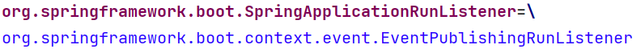
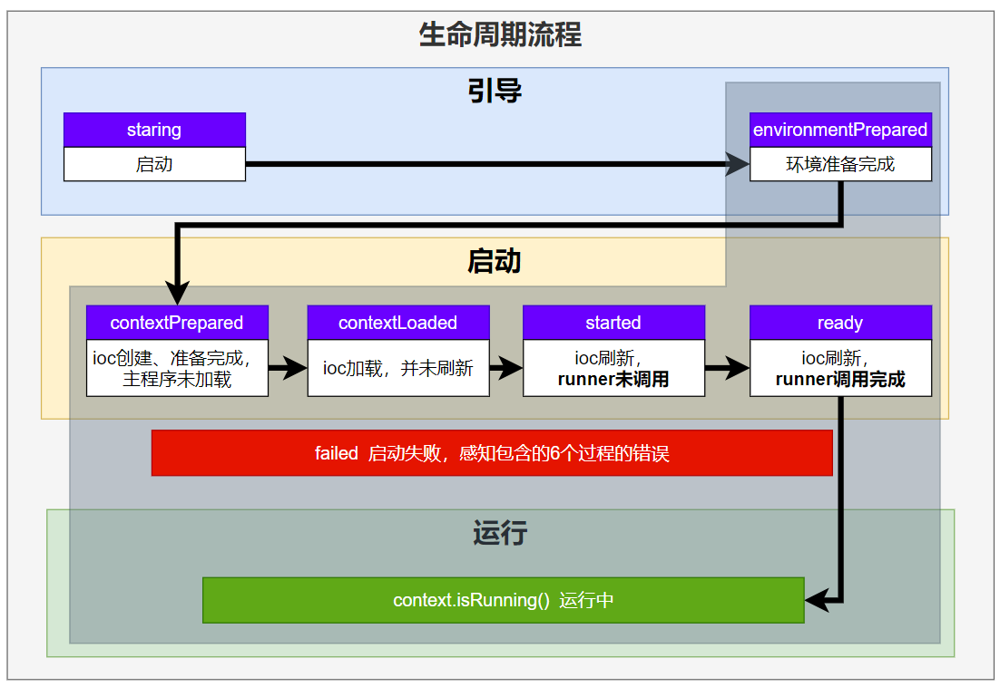
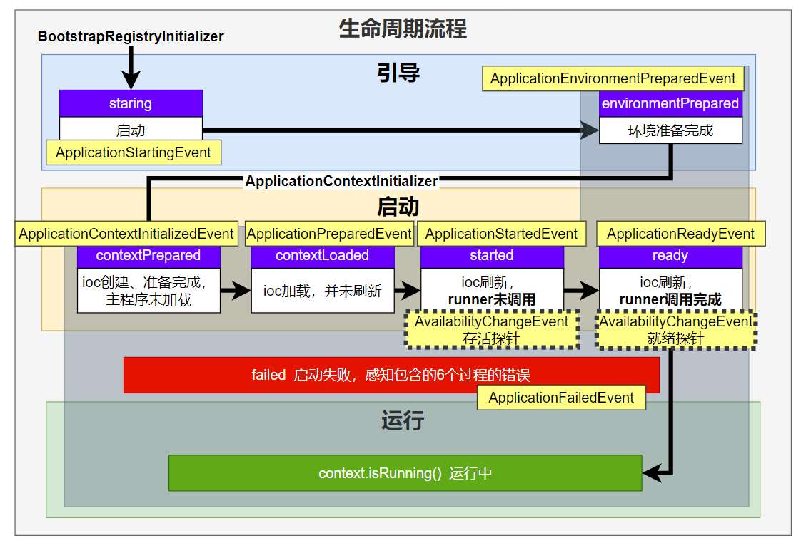
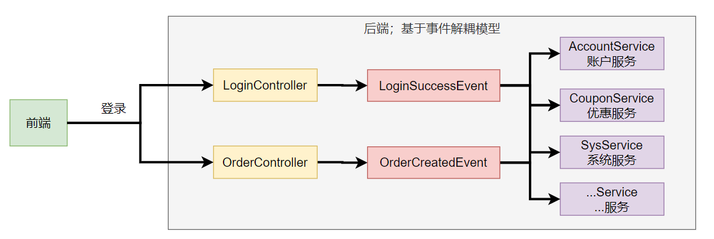
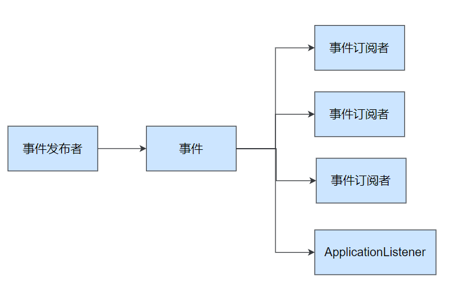
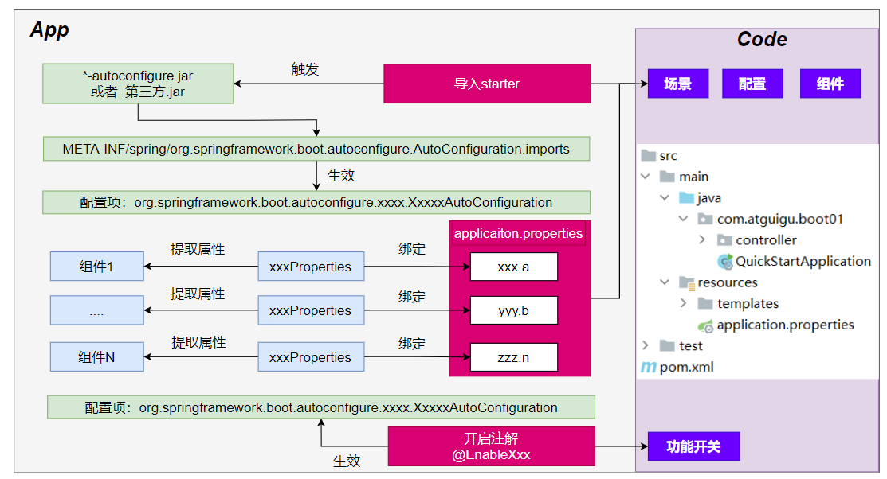

# 1. 事件和监听器
## 1. 生命周期监听
场景：监听**应用**的**生命周期**
### 1. 监听器-SpringApplicationRunListener

1. 自定义`SpringApplicationRunListener`来**监听事件**；
   1. 编写`SpringApplicationRunListener` **实现类**
   2. 在 `META-INF/spring.factories` 中配置 `org.springframework.boot.SpringApplicationRunListener=自己的Listener`，还可以指定一个**有参构造器**，接受两个参数`(SpringApplication application, String[] args)`
   3. springboot 在`spring-boot.jar`中配置了默认的 Listener，如下



```java
/**
 * Listener先要从 META-INF/spring.factories 读到
 *
 * 1、引导： 利用 BootstrapContext 引导整个项目启动
 *      starting：              应用开始，SpringApplication的run方法一调用，只要有了 BootstrapContext 就执行
 *      environmentPrepared：   环境准备好（把启动参数等绑定到环境变量中），但是ioc还没有创建；【调一次】
 * 2、启动：
 *      contextPrepared：       ioc容器创建并准备好，但是sources（主配置类）没加载。并关闭引导上下文；组件都没创建  【调一次】
 *      contextLoaded：         ioc容器加载。主配置类加载进去了。但是ioc容器还没刷新（我们的bean没创建）。
 *      =======截止以前，ioc容器里面还没造bean呢=======
 *      started：               ioc容器刷新了（所有bean造好了），但是 runner 没调用。
 *      ready:                  ioc容器刷新了（所有bean造好了），所有 runner 调用完了。
 * 3、运行
 *     以前步骤都正确执行，代表容器running。
 */
```

### 2. 生命周期全流程

## 2. 事件触发时机
### 1. 各种回调监听器

- `BootstrapRegistryInitializer`：   ** 感知特定阶段：**感知**引导初始化**
   - `META-INF/spring.factories`
   - 创建引导上下文`bootstrapContext`的时候触发。
   - application.`addBootstrapRegistryInitializer`();
   - 场景：`进行密钥校对授权。`
- ApplicationContextInitializer：  ** 感知特定阶段：** 感知ioc容器初始化
   - `META-INF/spring.factories`
   - application.addInitializers();
- **ApplicationListener：    感知全阶段：基于事件机制，感知事件。 一旦到了哪个阶段可以做别的事**
   - `@Bean`或`@EventListener`： `事件驱动`
   - `SpringApplication.addListeners(…)`或 `SpringApplicationBuilder.listeners(…)`
   - `META-INF/spring.factories`
- **SpringApplicationRunListener：       感知全阶段生命周期 + 各种阶段都能自定义操作； 功能更完善。**
   - `META-INF/spring.factories`
- **ApplicationRunner:          感知特定阶段：感知应用就绪Ready。卡死应用，就不会就绪**
   - `@Bean`
- **CommandLineRunner：   感知特定阶段：感知应用就绪Ready。卡死应用，就不会就绪**
   - `@Bean`


最佳实战：

- 如果项目启动前做事： `BootstrapRegistryInitializer` 和 `ApplicationContextInitializer`
- 如果想要在项目启动完成后做事：`**ApplicationRunner**`**和 **`**CommandLineRunner**`
- **如果要干涉生命周期做事：**`**SpringApplicationRunListener**`
- **如果想要用事件机制：**`**ApplicationListener**`


### 2. 完整触发流程
`**9大事件**`触发顺序&时机

1. `ApplicationStartingEvent`：应用启动但未做任何事情, 除过注册listeners and initializers.
2. `ApplicationEnvironmentPreparedEvent`：  Environment 准备好，但context 未创建.
3. `ApplicationContextInitializedEvent`: ApplicationContext 准备好，ApplicationContextInitializers 调用，但是任何bean未加载
4. `ApplicationPreparedEvent`： 容器刷新之前，bean定义信息加载
5. `ApplicationStartedEvent`： 容器刷新完成， runner未调用

=========以下就开始插入了**探针机制**============

6. `AvailabilityChangeEvent`： `LivenessState.CORRECT`应用存活； **存活探针**
7. `ApplicationReadyEvent`: 任何runner被调用
8. `AvailabilityChangeEvent`：`ReadinessState.ACCEPTING_TRAFFIC`**就绪探针**，可以接请求
9.  `ApplicationFailedEvent `：启动出错



应用事件发送顺序如下：

感知应用是否**存活**了：可能植物状态，虽然活着但是不能处理请求。
应用是否**就绪**了：能响应请求，说明确实活的比较好。

### 3. SpringBoot 事件驱动开发
> **应用启动过程生命周期事件感知（9大事件）**、**应用运行中事件感知（无数种）**。

- **事件发布**：`ApplicationEventPublisherAware`或`注入：ApplicationEventMulticaster`
- **事件监听**：`组件 + @EventListener`




> 事件发布者

```java
@Service
public class EventPublisher implements ApplicationEventPublisherAware {

    /**
     * 底层发送事件用的组件，SpringBoot会通过ApplicationEventPublisherAware接口自动注入给我们
     * 事件是广播出去的。所有监听这个事件的监听器都可以收到
     */
    ApplicationEventPublisher applicationEventPublisher;

    /**
     * 所有事件都可以发
     * @param event
     */
    public void sendEvent(ApplicationEvent event) {
        //调用底层API发送事件
        applicationEventPublisher.publishEvent(event);
    }

    /**
     * 会被自动调用，把真正发事件的底层组组件给我们注入进来
     * @param applicationEventPublisher event publisher to be used by this object
     */
    @Override
    public void setApplicationEventPublisher(ApplicationEventPublisher applicationEventPublisher) {
        this.applicationEventPublisher = applicationEventPublisher;
    }
}
```

> 事件订阅者

```java
@Service
public class CouponService {

    @Order(1)
    @EventListener
    public void onEvent(LoginSuccessEvent loginSuccessEvent){
        System.out.println("===== CouponService ====感知到事件"+loginSuccessEvent);
        UserEntity source = (UserEntity) loginSuccessEvent.getSource();
        sendCoupon(source.getUsername());
    }

    public void sendCoupon(String username){
        System.out.println(username + " 随机得到了一张优惠券");
    }
}
```
# 2. 自动配置原理
## 1. 入门理解
> 应用关注的**三大核心**：**场景**、**配置**、**组件**

### 1. 自动配置流程


1. 导入`starter`
2. 依赖导入`autoconfigure`
3. 寻找类路径下 `META-INF/spring/org.springframework.boot.autoconfigure.AutoConfiguration.imports`文件
4. 启动，加载所有 `自动配置类` `xxxAutoConfiguration`
   1. 给容器中配置**功能**`组件`
   2. `组件参数`绑定到 `属性类`中。`xxxProperties`
   3. `属性类`和`配置文件`前缀项绑定
   4. `@Contional派生的条件注解`进行判断**是否组件生效**
5. 效果：
   1. 修改配置文件，修改底层参数
   2. 所有场景自动配置好直接使用
   3. 可以注入SpringBoot配置好的组件随时使用

### 2. SPI机制
> - **Java中的SPI（Service Provider Interface）是一种软件设计模式，用于在应用程序中动态地发现和加载组件。SPI的思想**是，定义一个接口或抽象类，然后通过在classpath中定义实现该接口的类来实现对组件的动态发现和加载。
> - SPI的主要目的是解决在应用程序中使用可插拔组件的问题。例如，一个应用程序可能需要使用不同的日志框架或数据库连接池，但是这些组件的选择可能取决于运行时的条件。通过使用SPI，应用程序可以在运行时发现并加载适当的组件，而无需在代码中硬编码这些组件的实现类。
> - 在Java中，**SPI**的实现方式是通过在`META-INF/services`目录下创建一个以服务接口全限定名为名字的文件，文件中包含实现该服务接口的类的全限定名。当应用程序启动时，Java的SPI机制会自动扫描classpath中的这些文件，并根据文件中指定的类名来加载实现类。
> - 通过使用SPI，应用程序可以实现更灵活、可扩展的架构，同时也可以避免硬编码依赖关系和增加代码的可维护性。
> 
以上回答来自`ChatGPT-3.5`


在SpringBoot中，`META-INF/spring/org.springframework.boot.autoconfigure.AutoConfiguration.imports`
> 作业：写一段java的spi机制代码


### 3. 功能开关

- 自动配置：全部都配置好，什么都不用管。   自动批量导入
   - 项目一启动，spi文件中指定的所有都加载。
- `@EnableXxxx`：手动控制哪些功能的开启； 手动导入。
   - 开启xxx功能
   - 都是利用 @Import 把此功能要用的组件导入进去


## 2. 进阶理解
### 1. @SpringBootApplication
#### @SpringBootConfiguration
就是： @Configuration ，容器中的组件，配置类。spring ioc启动就会加载创建这个类对象

#### @EnableAutoConfiguration：开启自动配置
开启自动配置
##### @AutoConfigurationPackage：扫描主程序包：加载自己的组件

- 利用 `@Import(AutoConfigurationPackages.Registrar.class)` 想要给容器中导入组件。
- 把主程序所在的**包**的所有组件导入进来。
- **为什么SpringBoot默认只扫描主程序所在的包及其子包**

##### @Import(AutoConfigurationImportSelector.class)：加载所有自动配置类：加载starter导入的组件
```java
		List<String> configurations = ImportCandidates.load(AutoConfiguration.class, getBeanClassLoader())
			.getCandidates();
```
> 扫描SPI文件：`META-INF/spring/org.springframework.boot.autoconfigure.AutoConfiguration.imports`


#### @ComponentScan
> 组件扫描：排除一些组件（哪些不要）
> 排除前面已经扫描进来的`配置类`、和`自动配置类`。

```
@ComponentScan(excludeFilters = { @Filter(type = FilterType.CUSTOM, classes = TypeExcludeFilter.class),
      @Filter(type = FilterType.CUSTOM, classes = AutoConfigurationExcludeFilter.class) })
```


### 2. 完整启动加载流程
> 生命周期启动加载流程


# 3. 自定义starter
> 场景：**抽取聊天机器人场景，它可以打招呼**。

> 效果：任何项目导入此`starter`都具有打招呼功能，并且**问候语**中的**人名**需要可以在**配置文件**中修改

- 1. 创建`自定义starter`项目，引入`spring-boot-starter`基础依赖
- 2. 编写模块功能，引入模块所有需要的依赖。
- 3. 编写`xxxAutoConfiguration`自动配置类，帮其他项目导入这个模块需要的所有组件
- 4. 编写配置文件`META-INF/spring/org.springframework.boot.autoconfigure.AutoConfiguration.imports`指定启动需要加载的自动配置
- 5. 其他项目引入即可使用


## 1. 业务代码
> 自定义配置有提示。导入以下依赖重启项目，再写配置文件就有提示

```java
@ConfigurationProperties(prefix = "robot")  //此属性类和配置文件指定前缀绑定
@Component
@Data
public class RobotProperties {

    private String name;
    private String age;
    private String email;
}

```

```xml
<!--        导入配置处理器，配置文件自定义的properties配置都会有提示-->
        <dependency>
            <groupId>org.springframework.boot</groupId>
            <artifactId>spring-boot-configuration-processor</artifactId>
            <optional>true</optional>
        </dependency>
```

## 2. 基本抽取

- 创建starter项目，把公共代码需要的所有依赖导入
- 把公共代码复制进来
- 自己写一个 `RobotAutoConfiguration`，给容器中导入这个场景需要的所有组件
   - 为什么这些组件默认不会扫描进去？
   - **starter所在的包和 引入它的项目的主程序所在的包不是父子层级**
- 别人引用这个`starter`，直接导入这个 `RobotAutoConfiguration`,就能把这个场景的组件导入进来
- 功能生效。
- 测试编写配置文件

## 3. 使用@EnableXxx机制
```java
@Retention(RetentionPolicy.RUNTIME)
@Target({ElementType.TYPE})
@Documented
@Import(RobotAutoConfiguration.class)
public @interface EnableRobot {


}
```
别人引入`starter`需要使用 `@EnableRobot`开启功能  
## 4. 完全自动配置

- 依赖SpringBoot的SPI机制
- META-INF/spring/org.springframework.boot.autoconfigure.AutoConfiguration.imports 文件中编写好我们自动配置类的全类名即可
- 项目启动，自动加载我们的自动配置类


