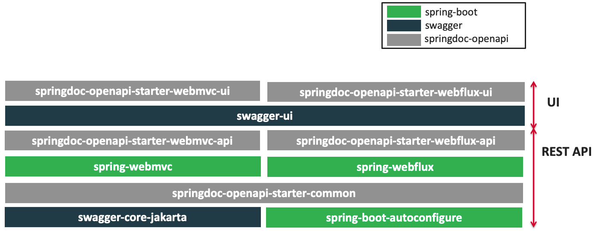

# OpenAPI 3 与 Swagger
> Swagger 可以快速生成**实时接口**文档，方便前后开发人员进行协调沟通。遵循 **OpenAPI** 规范。
> 文档：[https://springdoc.org/v2/](https://springdoc.org/v2/)

## 1.  OpenAPI 3 架构


## 2. 整合
导入场景
```xml
<dependency>
    <groupId>org.springdoc</groupId>
    <artifactId>springdoc-openapi-starter-webmvc-ui</artifactId>
    <version>2.1.0</version>
</dependency>
```
配置
```properties
# /api-docs endpoint custom path 默认 /v3/api-docs
springdoc.api-docs.path=/api-docs

# swagger 相关配置在  springdoc.swagger-ui
# swagger-ui custom path
springdoc.swagger-ui.path=/swagger-ui.html

springdoc.show-actuator=true
```

## 3. 使用
### 1. 常用注解
| 注解 | 标注位置 | 作用 |
| --- | --- | --- |
| @Tag | controller 类 | 标识 controller 作用 |
| @Parameter | 参数 | 标识参数作用 |
| @Parameters | 参数 | 参数多重说明 |
| @Schema | model 层的 JavaBean | 描述模型作用及每个属性 |
| @Operation | 方法 | 描述方法作用 |
| @ApiResponse | 方法 | 描述响应状态码等 |


### 2. Docket配置
> 如果有多个Docket，配置如下

```java
  @Bean
  public GroupedOpenApi publicApi() {
      return GroupedOpenApi.builder()
              .group("springshop-public")
              .pathsToMatch("/public/**")
              .build();
  }
  @Bean
  public GroupedOpenApi adminApi() {
      return GroupedOpenApi.builder()
              .group("springshop-admin")
              .pathsToMatch("/admin/**")
              .addMethodFilter(method -> method.isAnnotationPresent(Admin.class))
              .build();
  }
```

> 如果只有一个Docket，可以配置如下

```properties
springdoc.packagesToScan=package1, package2
springdoc.pathsToMatch=/v1, /api/balance/**
```

### 3. OpenAPI配置
```java
  @Bean
  public OpenAPI springShopOpenAPI() {
      return new OpenAPI()
              .info(new Info().title("SpringShop API")
              .description("Spring shop sample application")
              .version("v0.0.1")
              .license(new License().name("Apache 2.0").url("http://springdoc.org")))
              .externalDocs(new ExternalDocumentation()
              .description("SpringShop Wiki Documentation")
              .url("https://springshop.wiki.github.org/docs"));
  }
```
## 4. Springfox 迁移
### 3.1 注解变化
| 原注解 | 现注解 | 作用 |
| --- | --- | --- |
| @Api  | @Tag | 描述Controller |
| @ApiIgnore  | @Parameter(hidden = true) 
@Operation(hidden = true)
@Hidden | 描述忽略操作 |
| @ApiImplicitParam | @Parameter | 描述参数 |
| @ApiImplicitParams  | @Parameters | 描述参数 |
| @ApiModel | @Schema | 描述对象 |
| @ApiModelProperty(hidden = true) | @Schema(accessMode = READ_ONLY) | 描述对象属性 |
| @ApiModelProperty | @Schema | 描述对象属性 |
| @ApiOperation(value = "foo", notes = "bar") | @Operation(summary = "foo", description = "bar") | 描述方法 |
| @ApiParam  | @Parameter | 描述参数 |
| @ApiResponse(code = 404, message = "foo")  | @ApiResponse(responseCode = "404", description = "foo") | 描述响应 |


### 3.2 Docket配置
#### 1. 以前写法
```java
  @Bean
  public Docket publicApi() {
      return new Docket(DocumentationType.SWAGGER_2)
              .select()
              .apis(RequestHandlerSelectors.basePackage("org.github.springshop.web.public"))
              .paths(PathSelectors.regex("/public.*"))
              .build()
              .groupName("springshop-public")
              .apiInfo(apiInfo());
  }

  @Bean
  public Docket adminApi() {
      return new Docket(DocumentationType.SWAGGER_2)
              .select()
              .apis(RequestHandlerSelectors.basePackage("org.github.springshop.web.admin"))
              .paths(PathSelectors.regex("/admin.*"))
              .apis(RequestHandlerSelectors.withMethodAnnotation(Admin.class))
              .build()
              .groupName("springshop-admin")
              .apiInfo(apiInfo());
  }
```
#### 2. 新写法
```java
  @Bean
  public GroupedOpenApi publicApi() {
      return GroupedOpenApi.builder()
              .group("springshop-public")
              .pathsToMatch("/public/**")
              .build();
  }
  @Bean
  public GroupedOpenApi adminApi() {
      return GroupedOpenApi.builder()
              .group("springshop-admin")
              .pathsToMatch("/admin/**")
              .addOpenApiMethodFilter(method -> method.isAnnotationPresent(Admin.class))
              .build();
  }
```
#### 3. 添加OpenAPI组件
```java
  @Bean
  public OpenAPI springShopOpenAPI() {
      return new OpenAPI()
              .info(new Info().title("SpringShop API")
              .description("Spring shop sample application")
              .version("v0.0.1")
              .license(new License().name("Apache 2.0").url("http://springdoc.org")))
              .externalDocs(new ExternalDocumentation()
              .description("SpringShop Wiki Documentation")
              .url("https://springshop.wiki.github.org/docs"));
  }
```
