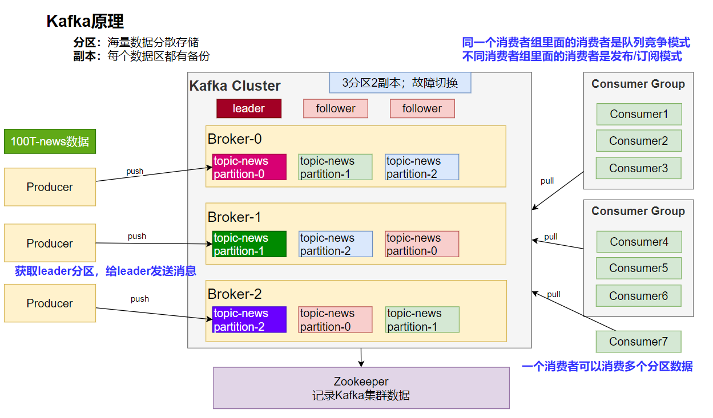

[https://kafka.apache.org/documentation/](https://kafka.apache.org/documentation/) 
# 消息队列-场景
## 异步


## 解耦


## 削峰


## 缓冲


# 消息队列-Kafka
## 1. 消息模式


## 2. Kafka工作原理



## 3. SpringBoot整合
参照：[https://docs.spring.io/spring-kafka/docs/current/reference/html/#preface](https://docs.spring.io/spring-kafka/docs/current/reference/html/#preface)
```xml
<dependency>
    <groupId>org.springframework.kafka</groupId>
    <artifactId>spring-kafka</artifactId>
</dependency>
```

配置
```properties
spring.kafka.bootstrap-servers=172.20.128.1:9092
```

修改`C:\Windows\System32\drivers\etc\hosts`文件，配置`8.130.32.70 kafka`
## 4. 消息发送
```java
@SpringBootTest
class Boot07KafkaApplicationTests {

    @Autowired
    KafkaTemplate kafkaTemplate;
    @Test
    void contextLoads() throws ExecutionException, InterruptedException {
        StopWatch watch = new StopWatch();
        watch.start();
        CompletableFuture[] futures = new CompletableFuture[10000];
        for (int i = 0; i < 10000; i++) {
            CompletableFuture send = kafkaTemplate.send("order", "order.create."+i, "订单创建了："+i);
            futures[i]=send;
        }
        CompletableFuture.allOf(futures).join();
        watch.stop();
        System.out.println("总耗时："+watch.getTotalTimeMillis());
    }

}
```
```java
import org.springframework.kafka.core.KafkaTemplate;
import org.springframework.stereotype.Component;

@Component
public class MyBean {

    private final KafkaTemplate<String, String> kafkaTemplate;

    public MyBean(KafkaTemplate<String, String> kafkaTemplate) {
        this.kafkaTemplate = kafkaTemplate;
    }

    public void someMethod() {
        this.kafkaTemplate.send("someTopic", "Hello");
    }

}
```
## 5. 消息监听
```java
@Component
public class OrderMsgListener {

    @KafkaListener(topics = "order",groupId = "order-service")
    public void listen(ConsumerRecord record){
        System.out.println("收到消息："+record); //可以监听到发给kafka的新消息，以前的拿不到
    }

    @KafkaListener(groupId = "order-service-2",topicPartitions = {
            @TopicPartition(topic = "order",partitionOffsets = {
                    @PartitionOffset(partition = "0",initialOffset = "0")
            })
    })
    public void listenAll(ConsumerRecord record){
        System.out.println("收到partion-0消息："+record);
    }
}
```
## 6. 参数配置
消费者
```properties
spring.kafka.consumer.value-deserializer=org.springframework.kafka.support.serializer.JsonDeserializer
spring.kafka.consumer.properties[spring.json.value.default.type]=com.example.Invoice
spring.kafka.consumer.properties[spring.json.trusted.packages]=com.example.main,com.example.another
```

生产者
```properties
spring.kafka.producer.value-serializer=org.springframework.kafka.support.serializer.JsonSerializer
spring.kafka.producer.properties[spring.json.add.type.headers]=false
```
## 7. 自动配置原理
kafka 自动配置在KafkaAutoConfiguration

1. 容器中放了 KafkaTemplate 可以进行消息收发
2. 容器中放了KafkaAdmin 可以进行 Kafka 的管理，比如创建 topic 等
3. kafka 的配置在KafkaProperties中
4. @EnableKafka可以开启基于注解的模式
