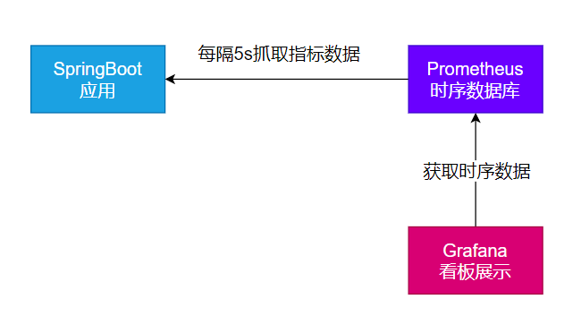
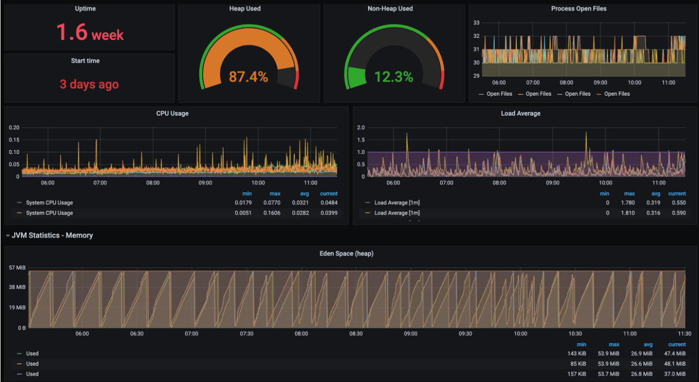

> 可观测性 Observability

对线上应用进行观测、监控、预警...

- 健康状况【组件状态、存活状态】Health
- 运行**指标**【cpu、内存、垃圾回收、吞吐量、响应成功率...】**Metrics**
- 链路追踪
- ...
# 1. SpringBoot Actuator
## 1. 实战
### 1. 场景引入
```xml
<dependency>
    <groupId>org.springframework.boot</groupId>
    <artifactId>spring-boot-starter-actuator</artifactId>
</dependency>
```

### 2. 暴露指标
```properties
management:
  endpoints:
    enabled-by-default: true #暴露所有端点信息
    web:
      exposure:
        include: '*'  #以web方式暴露
```

### 3. 访问数据

- 访问 [http://localhost:8080/actuator](http://localhost:8080/actuator/)；展示出所有可以用的监控端点
- [http://localhost:8080/actuator/beans](http://localhost:8080/actuator/beans)
- [http://localhost:8080/actuator/configprops](http://localhost:8080/actuator/configprops)
- [http://localhost:8080/actuator/metrics](http://localhost:8080/actuator/metrics)
- [http://localhost:8080/actuator/metrics/jvm.gc.pause](http://localhost:8080/actuator/metrics/jvm.gc.pause)
- [http://localhost:8080/actuator/](http://localhost:8080/actuator/metrics)endpointName/detailPath

## 2. Endpoint
### 1. 常用端点
| ID                           | 描述                                                                                                                            |
| ---------------------------- | ------------------------------------------------------------------------------------------------------------------------------- |
| `auditevents`                | 暴露当前应用程序的审核事件信息。需要一个`AuditEventRepository组件`。                                                            |
| `beans`                      | 显示应用程序中所有Spring Bean的完整列表。                                                                                       |
| `caches`                     | 暴露可用的缓存。                                                                                                                |
| `conditions`                 | 显示自动配置的所有条件信息，包括匹配或不匹配的原因。                                                                            |
| `configprops`                | 显示所有`@ConfigurationProperties`。                                                                                            |
| `env`                        | 暴露Spring的属性`ConfigurableEnvironment`                                                                                       |
| `flyway`                     | 显示已应用的所有Flyway数据库迁移。                                                                                              |
| 需要一个或多个`Flyway`组件。 |
| `health`                     | 显示应用程序运行状况信息。                                                                                                      |
| `httptrace`                  | 显示HTTP跟踪信息（默认情况下，最近100个HTTP请求-响应）。需要一个`HttpTraceRepository`组件。                                     |
| `info`                       | 显示应用程序信息。                                                                                                              |
| `integrationgraph`           | 显示Spring `integrationgraph` 。需要依赖`spring-integration-core`。                                                             |
| `loggers`                    | 显示和修改应用程序中日志的配置。                                                                                                |
| `liquibase`                  | 显示已应用的所有Liquibase数据库迁移。需要一个或多个`Liquibase`组件。                                                            |
| `metrics`                    | 显示当前应用程序的“指标”信息。                                                                                                  |
| `mappings`                   | 显示所有`@RequestMapping`路径列表。                                                                                             |
| `scheduledtasks`             | 显示应用程序中的计划任务。                                                                                                      |
| `sessions`                   | 允许从Spring Session支持的会话存储中检索和删除用户会话。需要使用Spring Session的基于Servlet的Web应用程序。                      |
| `shutdown`                   | 使应用程序正常关闭。默认禁用。                                                                                                  |
| `startup`                    | 显示由`ApplicationStartup`收集的启动步骤数据。需要使用`SpringApplication`进行配置`BufferingApplicationStartup`。                |
| `threaddump`                 | 执行线程转储。                                                                                                                  |
| `heapdump`                   | 返回`hprof`堆转储文件。                                                                                                         |
| `jolokia`                    | 通过HTTP暴露JMX bean（需要引入Jolokia，不适用于WebFlux）。需要引入依赖`jolokia-core`。                                          |
| `logfile`                    | 返回日志文件的内容（如果已设置`logging.file.name`或`logging.file.path`属性）。支持使用HTTP`Range`标头来检索部分日志文件的内容。 |
| `prometheus`                 | 以Prometheus服务器可以抓取的格式公开指标。需要依赖`micrometer-registry-prometheus`。                                            |

`threaddump`、`heapdump`、`metrics`
### 2. 定制端点

- 健康监控：返回存活、死亡
- 指标监控：次数、率
#### 1. HealthEndpoint
```java
import org.springframework.boot.actuate.health.Health;
import org.springframework.boot.actuate.health.HealthIndicator;
import org.springframework.stereotype.Component;

@Component
public class MyHealthIndicator implements HealthIndicator {

    @Override
    public Health health() {
        int errorCode = check(); // perform some specific health check
        if (errorCode != 0) {
            return Health.down().withDetail("Error Code", errorCode).build();
        }
        return Health.up().build();
    }

}

构建Health
Health build = Health.down()
                .withDetail("msg", "error service")
                .withDetail("code", "500")
                .withException(new RuntimeException())
                .build();
```

```properties
management:
    health:
      enabled: true
      show-details: always #总是显示详细信息。可显示每个模块的状态信息
```
```java
@Component
public class MyComHealthIndicator extends AbstractHealthIndicator {

    /**
     * 真实的检查方法
     * @param builder
     * @throws Exception
     */
    @Override
    protected void doHealthCheck(Health.Builder builder) throws Exception {
        //mongodb。  获取连接进行测试
        Map<String,Object> map = new HashMap<>();
        // 检查完成
        if(1 == 2){
//            builder.up(); //健康
            builder.status(Status.UP);
            map.put("count",1);
            map.put("ms",100);
        }else {
//            builder.down();
            builder.status(Status.OUT_OF_SERVICE);
            map.put("err","连接超时");
            map.put("ms",3000);
        }


        builder.withDetail("code",100)
                .withDetails(map);

    }
}
```

#### 2. MetricsEndpoint 
```java
class MyService{
    Counter counter;
    public MyService(MeterRegistry meterRegistry){
         counter = meterRegistry.counter("myservice.method.running.counter");
    }

    public void hello() {
        counter.increment();
    }
}

```

# 2. 监控案例落地
> 基于 Prometheus + Grafana
> 

## 1. 安装 Prometheus + Grafana
```shell
#安装prometheus:时序数据库
docker run -p 9090:9090 -d \
-v pc:/etc/prometheus \
prom/prometheus

#安装grafana；默认账号密码 admin:admin
docker run -d --name=grafana -p 3000:3000 grafana/grafana
```

## 2. 导入依赖
```xml
<dependency>
    <groupId>org.springframework.boot</groupId>
    <artifactId>spring-boot-starter-actuator</artifactId>
</dependency>
<dependency>
    <groupId>io.micrometer</groupId>
    <artifactId>micrometer-registry-prometheus</artifactId>
    <version>1.10.6</version>
</dependency>
```
```properties
management:
  endpoints:
    web:
      exposure: #暴露所有监控的端点
        include: '*'
```
访问： [http://localhost:8001/actuator/prometheus](http://localhost:8001/actuator/prometheus)  验证，返回 prometheus 格式的所有指标

> 部署Java应用

```shell
#安装上传工具
yum install lrzsz

#安装openjdk
# 下载openjdk
wget https://download.oracle.com/java/17/latest/jdk-17_linux-x64_bin.tar.gz

mkdir -p /opt/java
tar -xzf jdk-17_linux-x64_bin.tar.gz -C /opt/java/
sudo vi /etc/profile
#加入以下内容
export JAVA_HOME=/opt/java/jdk-17.0.7
export PATH=$PATH:$JAVA_HOME/bin

#环境变量生效
source /etc/profile


# 后台启动java应用
nohup java -jar boot3-14-actuator-0.0.1-SNAPSHOT.jar > output.log 2>&1 &

```
确认可以访问到： [http://8.130.32.70:9999/actuator/prometheus](http://8.130.32.70:9999/actuator/prometheus)
## 3. 配置 Prometheus 拉取数据
```yaml
## 修改 prometheus.yml 配置文件
scrape_configs:
  - job_name: 'spring-boot-actuator-exporter'
    metrics_path: '/actuator/prometheus' #指定抓取的路径
    static_configs:
      - targets: ['192.168.200.1:8001']
        labels:
          nodename: 'app-demo'
```
## 4. 配置 Grafana 监控面板

- 添加数据源（Prometheus）
- 添加面板。可去 dashboard 市场找一个自己喜欢的面板，也可以自己开发面板;[Dashboards | Grafana Labs](https://grafana.com/grafana/dashboards/?plcmt=footer)

## 5. 效果

