# 1. AOT与JIT
**AOT**：Ahead-of-Time（提前**编译**）：**程序执行前**，全部被编译成**机器码**
**JIT**：Just in Time（即时**编译**）: 程序边**编译**，边运行；
**编译： **

- **源代码（.c、.cpp、.go、.java。。。） ===编译===  机器码**


**语言：**

- **编译型语言：编译器**
- **解释型语言：解释器**
## 1. Complier 与 Interpreter
Java：**半编译半解释**
[https://anycodes.cn/editor](https://anycodes.cn/editor)
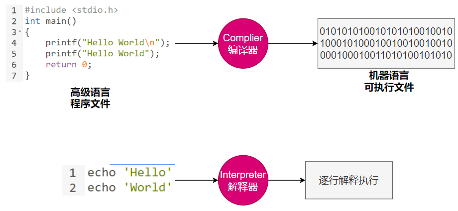

| 对比项                 | **编译器**                                         | **解释器**                                               |
| ---------------------- | -------------------------------------------------- | -------------------------------------------------------- |
| **机器执行速度**       | **快**，因为源代码只需被转换一次                   | **慢**，因为每行代码都需要被解释执行                     |
| **开发效率**           | **慢**，因为需要耗费大量时间编译                   | **快**，无需花费时间生成目标代码，更快的开发和测试       |
| **调试**               | **难以调试**编译器生成的目标代码                   | **容易调试**源代码，因为解释器一行一行地执行             |
| **可移植性（跨平台）** | 不同平台需要重新编译目标平台代码                   | 同一份源码可以跨平台执行，因为每个平台会开发对应的解释器 |
| **学习难度**           | 相对较高，需要了解源代码、编译器以及目标机器的知识 | 相对较低，无需了解机器的细节                             |
| **错误检查**           | 编译器可以在编译代码时检查错误                     | 解释器只能在执行代码时检查错误                           |
| **运行时增强**         | 无                                                 | 可以**动态增强**                                         |

## 2. AOT 与 JIT 对比
|      | JIT                    | AOT |
| ---- | ---------------------- | --- |
| 优点 | 1.具备**实时调整**能力 |
2.生成**最优机器指令**
3.根据代码运行情况**优化内存占用** | 1.速度快，优化了运行时编译时间和内存消耗
2.程序初期就能达最高性能
3.加快程序启动速度 |
| 缺点 | 1.运行期边编译**速度慢**
2.初始编译不能达到**最高性能** | 1.程序第一次编译占用时间长
2.牺牲**高级语言**一些特性 |

在 OpenJDK 的官方 Wiki 上，介绍了HotSpot 虚拟机一个相对比较全面的、**即时编译器（JIT）**中采用的[优化技术列表](https://xie.infoq.cn/link?target=https%3A%2F%2Fwiki.openjdk.java.net%2Fdisplay%2FHotSpot%2FPerformanceTacticIndex)。
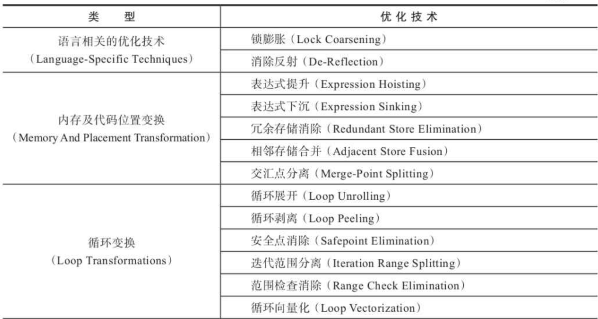

可使用：-XX:+PrintCompilation 打印JIT编译信息
## 3. JVM架构
.java === .class === 机器码
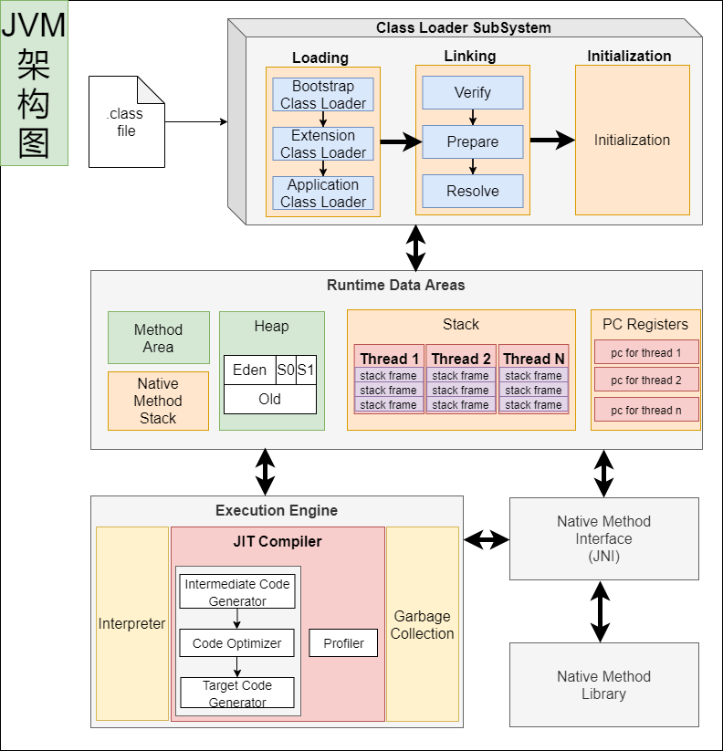
**JVM**: 既有**解释器**，又有**编辑器（JIT：即时编译）**；

## 4. Java的执行过程
> 建议阅读：
> - 美团技术：[https://tech.meituan.com/2020/10/22/java-jit-practice-in-meituan.html](https://tech.meituan.com/2020/10/22/java-jit-practice-in-meituan.html)
> - openjdk官网：[https://wiki.openjdk.org/display/HotSpot/Compiler](https://wiki.openjdk.org/display/HotSpot/Compiler)

### 流程概要
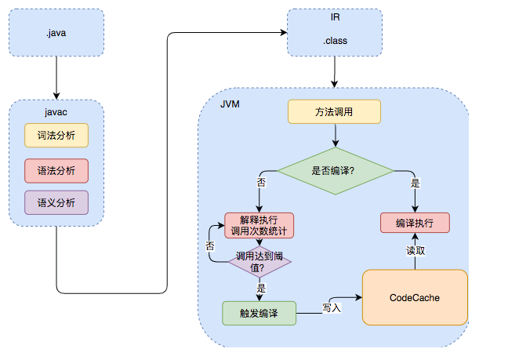
解释执行：
编译执行：
### 详细流程
热点代码：调用次数非常多的代码
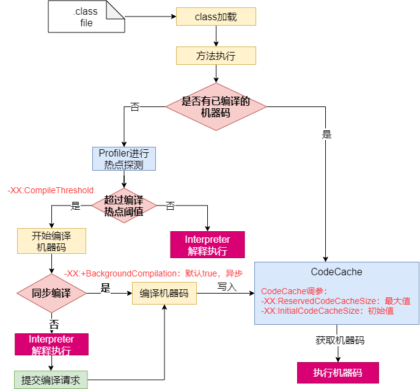

## 5. JVM编译器
JVM中集成了两种编译器，Client Compiler 和 Server Compiler；

- Client Compiler注重启动速度和局部的优化
- Server Compiler更加关注全局优化，性能更好，但由于会进行更多的全局分析，所以启动速度会慢。

Client Compiler：

- HotSpot VM带有一个Client Compiler **C1编译器**
- 这种编译器**启动速度快**，但是性能比较Server Compiler来说会差一些。
- 编译后的机器码执行效率没有C2的高

Server Compiler：

- Hotspot虚拟机中使用的Server Compiler有两种：**C2** 和 **Graal**。
- 在Hotspot VM中，默认的Server Compiler是**C2编译器。**

## 6. 分层编译
Java 7开始引入了分层编译(**Tiered Compiler**)的概念，它结合了**C1**和**C2**的优势，追求启动速度和峰值性能的一个平衡。分层编译将JVM的执行状态分为了五个层次。**五个层级**分别是：

- 解释执行。
- 执行不带profiling的C1代码。
- 执行仅带方法调用次数以及循环回边执行次数profiling的C1代码。
- 执行带所有profiling的C1代码。
- 执行C2代码。

**profiling就是收集能够反映程序执行状态的数据**。其中最基本的统计数据就是方法的调用次数，以及循环回边的执行次数。
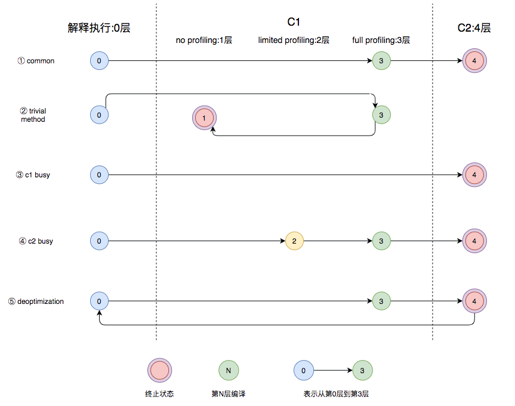

- 图中第①条路径，代表编译的一般情况，**热点方法**从解释执行到被3层的C1编译，最后被4层的C2编译。
- 如果**方法比较小**（比如Java服务中常见的**getter/setter**方法），3层的profiling没有收集到有价值的数据，JVM就会断定该方法对于C1代码和C2代码的执行效率相同，就会执行图中第②条路径。在这种情况下，JVM会在3层编译之后，放弃进入C2编译，**直接选择用1层的C1编译运行**。
- 在**C1忙碌**的情况下，执行图中第③条路径，在解释执行过程中对程序进行**profiling** ，根据信息直接由第4层的**C2编译**。
- 前文提到C1中的执行效率是**1层>2层>3层**，**第3层**一般要比**第2层**慢35%以上，所以在**C2忙碌**的情况下，执行图中第④条路径。这时方法会被2层的C1编译，然后再被3层的C1编译，以减少方法在**3层**的执行时间。
- 如果**编译器**做了一些比较**激进的优化**，比如分支预测，在实际运行时**发现预测出错**，这时就会进行**反优化**，重新进入**解释执行**，图中第⑤条执行路径代表的就是**反优化**。

总的来说，C1的编译速度更快，C2的编译质量更高，分层编译的不同编译路径，也就是JVM根据当前服务的运行情况来寻找当前服务的最佳平衡点的一个过程。从JDK 8开始，JVM默认开启分层编译。

**云原生**：Cloud Native； Java小改版；

最好的效果：
存在的问题：

- java应用如果用jar，解释执行，热点代码才编译成机器码；初始启动速度慢，初始处理请求数量少。
- 大型云平台，要求每一种应用都必须秒级启动。每个应用都要求效率高。

希望的效果：

- java应用也能提前被编译成**机器码**，随时**急速启动**，一启动就急速运行，最高性能
- 编译成机器码的好处：
   - 另外的服务器还需要安装Java环境
   - 编译成**机器码**的，可以在这个平台 Windows X64 **直接运行**。

**原生**镜像：**native**-image（机器码、本地镜像）

- 把应用打包成能适配本机平台 的可执行文件（机器码、本地镜像）
# 2. GraalVM
[https://www.graalvm.org/](https://www.graalvm.org/)
> **GraalVM**是一个高性能的**JDK**，旨在**加速**用Java和其他JVM语言编写的**应用程序**的**执行**，同时还提供JavaScript、Python和许多其他流行语言的运行时。 
> **GraalVM**提供了**两种**运行**Java应用程序**的方式：
> - 1. 在HotSpot JVM上使用**Graal即时（JIT）编译器**
> - 2. 作为**预先编译（AOT）**的本机**可执行文件**运行（**本地镜像**）。
> 
 GraalVM的多语言能力使得在单个应用程序中混合多种编程语言成为可能，同时消除了外部语言调用的成本。


## 1. 架构
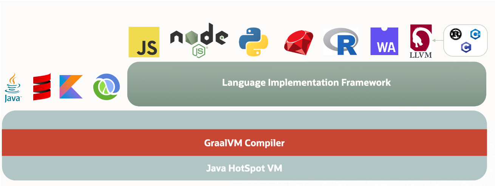
## 2. 安装
> 跨平台提供原生镜像原理：


### 1. VisualStudio
[https://visualstudio.microsoft.com/zh-hans/free-developer-offers/](https://visualstudio.microsoft.com/zh-hans/free-developer-offers/)


别选中文


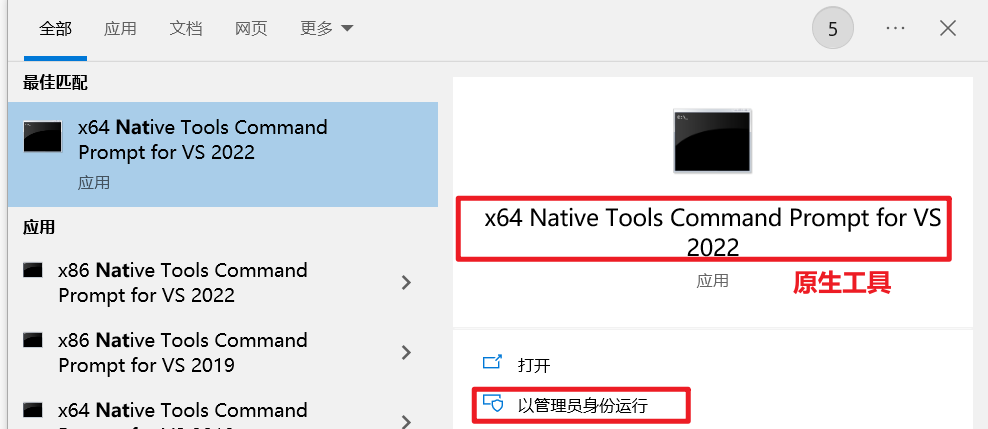

记住你安装的地址；

### 2. GraalVM 
#### 1. 安装
下载 GraalVM + native-image


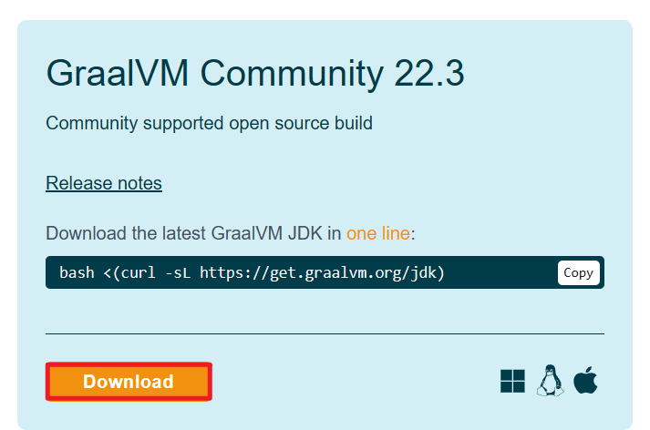

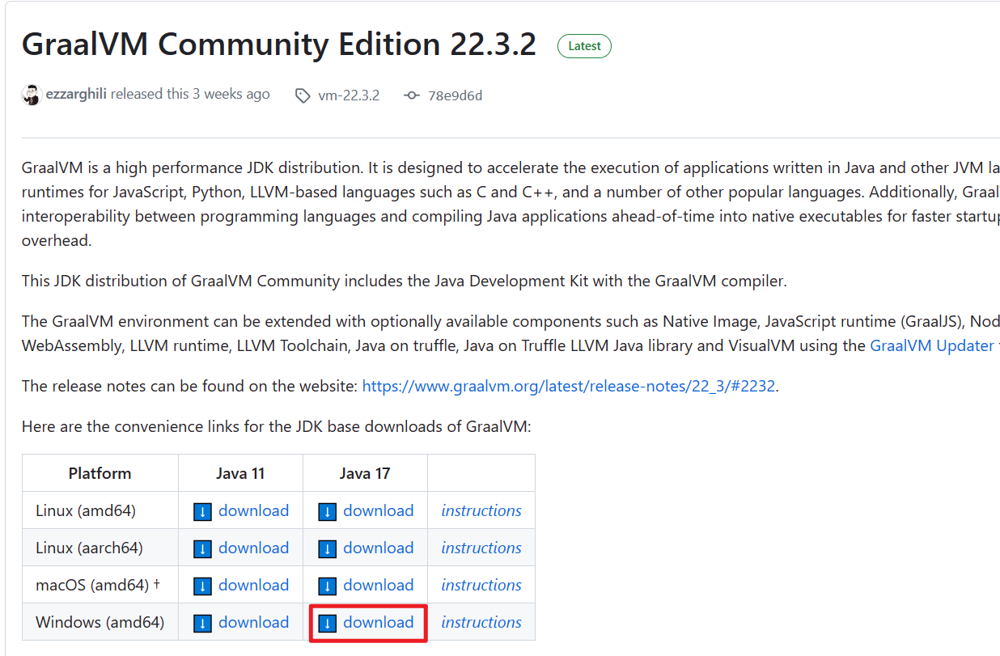

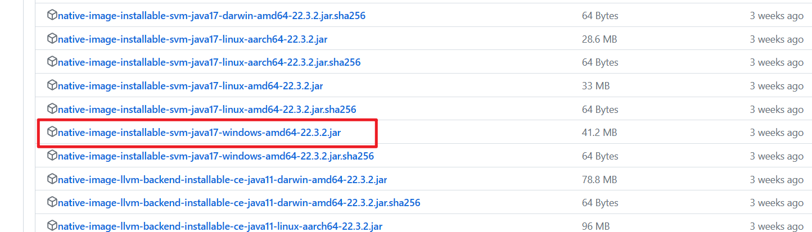

#### 2. 配置
修改 JAVA_HOME 与 Path，指向新bin路径
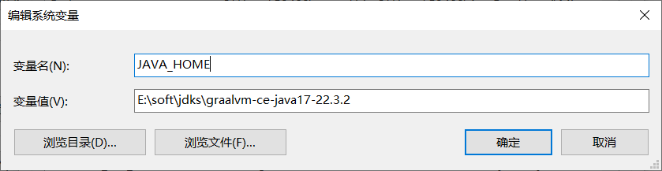
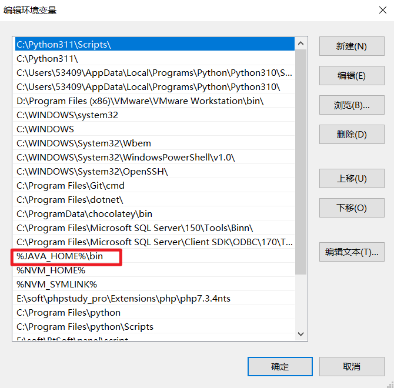

验证JDK环境为GraalVM提供的即可：
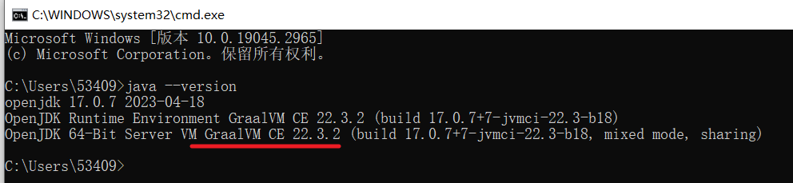

#### 3. 依赖
安装 native-image 依赖：

1. 网络环境好：参考：[https://www.graalvm.org/latest/reference-manual/native-image/#install-native-image](https://www.graalvm.org/latest/reference-manual/native-image/#install-native-image)
```shell
gu install native-image
```

2. 网络不好，使用我们下载的离线jar;`native-image-xxx.jar`文件
```shell
gu install --file native-image-installable-svm-java17-windows-amd64-22.3.2.jar
```
#### 4. 验证
```shell
native-image
```


## 3. 测试
### 1. 创建项目

- 1. 创建普通java项目。编写HelloWorld类；
   - 使用`mvn clean package`进行打包
   - 确认jar包是否可以执行`java -jar xxx.jar`
   - 可能需要给 `MANIFEST.MF`添加 `Main-Class: 你的主类`

### 2. 编译镜像

- 编译为原生镜像（native-image）：使用`native-tools`终端

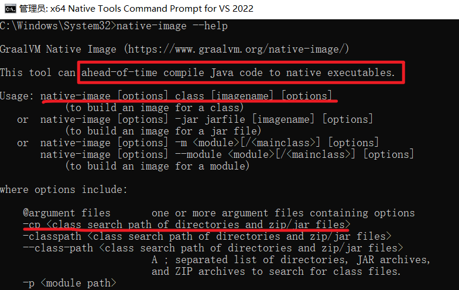
```shell
#从入口开始，编译整个jar
native-image -cp boot3-15-aot-common-1.0-SNAPSHOT.jar com.atguigu.MainApplication -o Haha

#编译某个类【必须有main入口方法，否则无法编译】
native-image -cp .\classes org.example.App
```


### 3. Linux平台测试

- 1. 安装gcc等环境
```shell
yum install lrzsz
sudo yum install gcc glibc-devel zlib-devel
```

- 2. 下载安装配置Linux下的GraalVM、native-image
   - 下载：[https://www.graalvm.org/downloads/](https://www.graalvm.org/downloads/)
   - 安装：GraalVM、native-image
   - 配置：JAVA环境变量为GraalVM
```shell
tar -zxvf graalvm-ce-java17-linux-amd64-22.3.2.tar.gz -C /opt/java/

sudo vim /etc/profile
#修改以下内容
export JAVA_HOME=/opt/java/graalvm-ce-java17-22.3.2
export PATH=$PATH:$JAVA_HOME/bin

source /etc/profile
```

- 3. 安装native-image
```shell
gu install --file native-image-installable-svm-java17-linux-amd64-22.3.2.jar
```

- 4. 使用native-image编译jar为原生程序
```shell
native-image -cp xxx.jar org.example.App
```

# 3. SpringBoot整合
## 1. 依赖导入
```xml
 <build>
        <plugins>
            <plugin>
                <groupId>org.graalvm.buildtools</groupId>
                <artifactId>native-maven-plugin</artifactId>
            </plugin>
            <plugin>
                <groupId>org.springframework.boot</groupId>
                <artifactId>spring-boot-maven-plugin</artifactId>
            </plugin>
        </plugins>
    </build>
```
## 2. 生成native-image
1、运行aot提前处理命令：`mvn springboot:process-aot`
2、运行native打包：`mvn -Pnative native:build`
```shell
# 推荐加上 -Pnative
mvn -Pnative native:build -f pom.xml
```
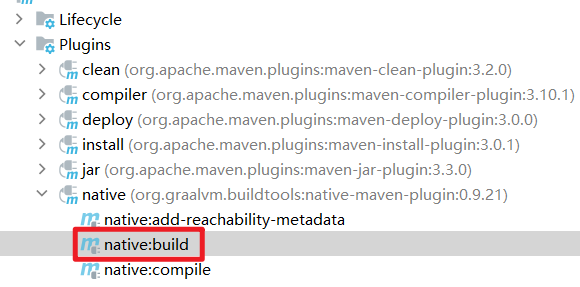


## 3. 常见问题
可能提示如下各种错误，无法构建原生镜像，需要配置环境变量；

- 出现`cl.exe`找不到错误
- 出现乱码
- 提示`no include path set`
- 提示fatal error LNK1104: cannot open file 'LIBCMT.lib'
- 提示 LINK : fatal error LNK1104: cannot open file 'kernel32.lib'
- 提示各种其他找不到

**需要修改三个环境变量**：`Path`、`INCLUDE`、`lib`

- 1、 Path：添加如下值
   - `C:\Program Files\Microsoft Visual Studio\2022\Community\VC\Tools\MSVC\14.33.31629\bin\Hostx64\x64`
- 2、新建`INCLUDE`环境变量：值为
```
C:\Program Files\Microsoft Visual Studio\2022\Community\VC\Tools\MSVC\14.33.31629\include;C:\Program Files (x86)\Windows Kits\10\Include\10.0.19041.0\shared;C:\Program Files (x86)\Windows Kits\10\Include\10.0.19041.0\ucrt;C:\Program Files (x86)\Windows Kits\10\Include\10.0.19041.0\um;C:\Program Files (x86)\Windows Kits\10\Include\10.0.19041.0\winrt
```
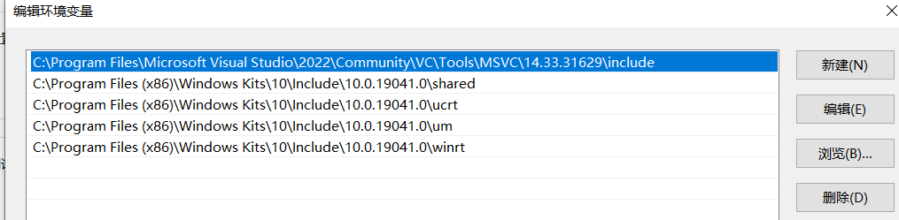

- 3、新建`lib`环境变量：值为
```latex
C:\Program Files\Microsoft Visual Studio\2022\Community\VC\Tools\MSVC\14.33.31629\lib\x64;C:\Program Files (x86)\Windows Kits\10\Lib\10.0.19041.0\um\x64;C:\Program Files (x86)\Windows Kits\10\Lib\10.0.19041.0\ucrt\x64
```
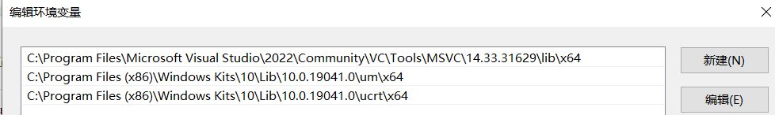


