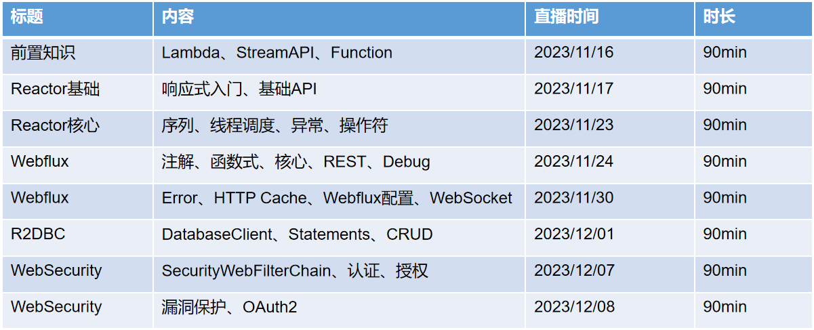

> 最近一直在讲线下课，课程完就会录制。我知道大家很急，但是...

准备要直播讲解全套的响应式编程了
> 大纲预览：【金山文档】 响应式编程完全指南  [https://kdocs.cn/l/ctMIKptrErPe](https://kdocs.cn/l/ctMIKptrErPe)

> 到时候会把直播渠道链接发到这里

> 11月16日开始直播，每周两次，预计4周；语雀文档同步更新。直播计划安排如下

SpringBoot响应式编程线上免费训练营来袭！
代码地址：[https://gitee.com/leifengyang/reactor-programming](https://gitee.com/leifengyang/reactor-programming)
每周四、五晚8点尚硅谷B站直播，扫码参与：[https://b23.tv/j5l1zjC](https://b23.tv/j5l1zjC)

